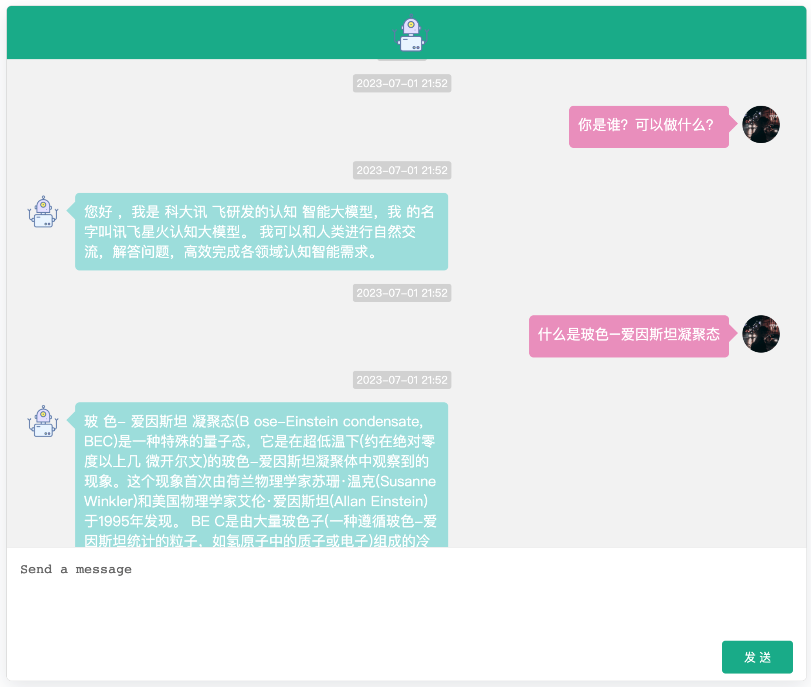
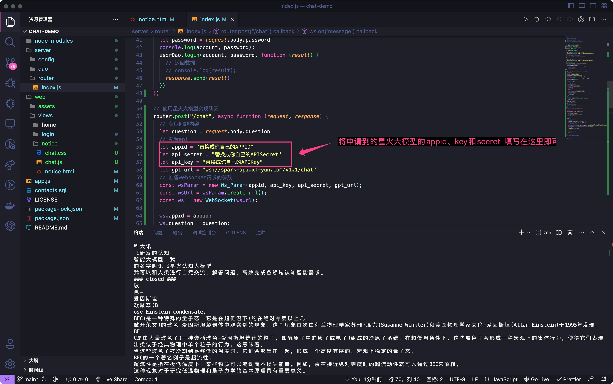

# spark-chat

基于讯飞星火认知大模型实现的聊天应用，web 文档中官方只提供了 Pyhton 和 Java 版本，这是参照 Python 版本实现的 node-express 的版本

前提：需要申请讯飞星火认知大模型 API，申请通过后将对的 APPID、APIKey 和 APISecret 填入路由文件（/server/router/index.js）的配置中即可正常使用

